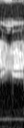
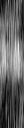

# Inverse Problem with Score-Based Diffusion Model
Please first install `PyTorch` following the [official website](https://pytorch.org/). Then please install other 
dependencies by:
```bash
git clone https://github.com/10258392511/InverseProblemWithDiffusionModel
cd InverseProblemWithDiffusionModel
pip3 install -e .
```
### NCSN for 2D Complex-Valued MR Image Reconstruction
<figure>
    
    <figcaption><strong>Comparing ALD reconstruction with MAP and TV reconstruction. We computed the mean of 105 reconstructions and it outperforms distinctively over MAP and TV reconstruction under the high acceleration rate R = 40 with 4 coils.</strong></figcaption>
</figure>

### NCSN for 2D + Time Cardiac MR Reconstruction
<table align="center" id="NCSN-3D-unconditional">
    <tbody align="center">
        <tr>
            <td></td>
            <td><figure> <br> <figurecaption>GT</figurecaption></figure></td>
            <td></td>
        </tr>
        <tr>
            <td><figure>  <br> <figurecaption>$\alpha = 10^{-4}$</figurecaption></figure></td>
            <td><figure>  <br> <figurecaption>$\alpha = 5 \times 10^{-5}$</figurecaption></figure></td>
            <td><figure>  <br> <figurecaption>$\alpha = 1.75 \times 10^{-5}$</figurecaption></figure></td>
        </tr>
        <tr>
            <td><figure>  <br> <figurecaption>$\alpha = 1.5 \times 10^{-5}$</figurecaption></figure></td>
            <td><figure>  <br> <figurecaption>$\alpha = 1.25 \times 10^{-5}$</figurecaption></figure></td>
            <td><figure>  <br> <figurecaption>$\alpha = 10^{-5}$</figurecaption></figure></td>
        </tr>
    </tbody>
    
    
</table>
<div align="center">
    <strong>CINE127 temporal unconditional real / imaginary samples with different ALD learning rate &alpha;.</strong>
</div>

<br>
<table align="center" id="NCSN-3D-results">
    <tr>
        <th>R</th>
        <th>Algorithm</th>
        <th>Mag<span style="color: white;">.</span></th>
        <th >Phase</th>
        <th>Mag<span style="color: white;">.</span> @ T / 2</th>
        <th>Phase @ T / 2</th>
        <th>Mag<span style="color: white;">.</span> @ H / 2</th>
        <th>NRMSE</th>
        <th>SSIM</th>
    </tr>
    <tbody align="center">
        <tr>
            <td>8</td>
            <td>Original</td>
            <td></td>
            <td></td>
            <td></td>
            <td></td>
            <td></td>
            <td>N/A</td>
            <td>N/A</td>
        </tr>
        <tr>
            <td>8</td>
            <td>ZF</td>
            <td></td>
            <td></td>
            <td></td>
            <td></td>
            <td></td>
            <td>0.439</td>
            <td>0.502</td>
        </tr>
        <tr>
            <td>8</td>
            <td>ALD Best</td>
            <td></td>
            <td></td>
            <td></td>
            <td></td>
            <td></td>
            <td>0.073</td>
            <td>0.953</td>
        </tr>
        <tr>
            <td>8</td>
            <td>MAP Best</td>
            <td></td>
            <td></td>
            <td></td>
            <td></td>
            <td></td>
            <td>0.091</td>
            <td>0.955</td>
        </tr>
        <tr>
            <td>16</td>
            <td>Original</td>
            <td></td>
            <td></td>
            <td></td>
            <td></td>
            <td></td>
            <td>N/A</td>
            <td>N/A</td>
        </tr>
        <tr>
            <td>16</td>
            <td>ZF</td>
            <td></td>
            <td></td>
            <td></td>
            <td></td>
            <td></td>
            <td>0.512</td>
            <td>0.412</td>
        </tr>
        <tr>
            <td>16</td>
            <td>ALD Best</td>
            <td></td>
            <td></td>
            <td></td>
            <td></td>
            <td></td>
            <td>0.141</td>
            <td>0.865</td>
        </tr>
        <tr>
            <td>16</td>
            <td>MAP Best</td>
            <td></td>
            <td></td>
            <td></td>
            <td></td>
            <td></td>
            <td>0.161</td>
            <td>0.871</td>
        </tr>
    </tbody>
</table>

<div align="center">
    <strong>Results on cardiac MR data. Our algorithms reconstruct image very close to GT under moderate acceleration rate; and still work very well under very high acceleration rate. </strong>
</div>
